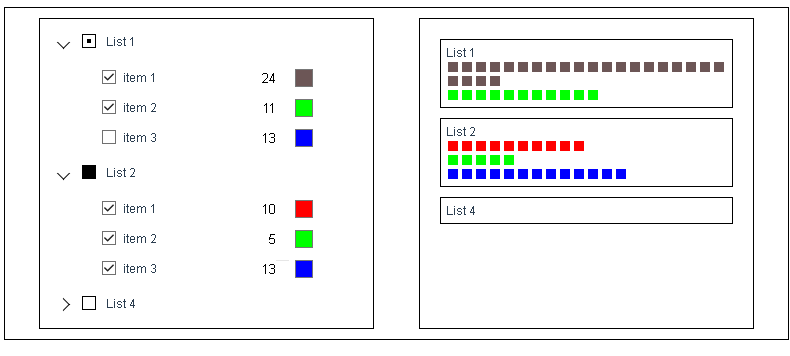

# color-lists



App contains two blocks. Left block is used to choose which colors to show, their ammount and color. Right block shows chosen colors.

Vuex is used to store app state.

## Project setup

```
npm install
```

### Compiles and hot-reloads for development

```
npm run serve
```

### Compiles and minifies for production

```
npm run build
```
